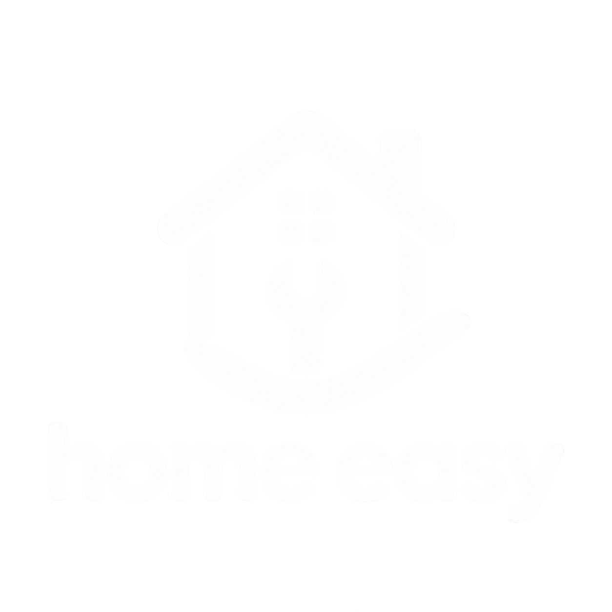
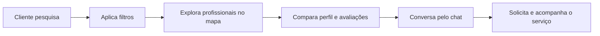

<div align="center">
  

  # Home Easy

  **Serviços para sua casa, perto de você.**

  Uma plataforma que conecta clientes a profissionais de serviços domésticos e reformas — da busca ao atendimento, em um só lugar.

  [](https://angular.io/)
  [](https://www.typescriptlang.org/)
  [](https://firebase.google.com/)
  [](https://leafletjs.com/)
  [](#roadmap)

  [Abrir o redesign](https://homeeasy-bd496.web.app/home) · [Ver versão legada](https://homeeasy-52792.web.app/home) · [Executar localmente](#-executando-localmente)
</div>

---

## 🏠 O que é o Home Easy?

O **Home Easy** é um marketplace de serviços para casa, com uma proposta semelhante a plataformas como o GetNinjas. Clientes encontram profissionais da sua região, comparam serviços e avaliações, conversam pelo chat e acompanham seus pedidos. Profissionais podem divulgar seu trabalho, receber solicitações e administrar os atendimentos.

O projeto nasceu há seis anos como Trabalho de Conclusão de Curso no **IFPE** e foi redesenhado para transformar uma aplicação acadêmica em uma experiência de produto mais moderna, útil e utilizável.

## 🌐 Aplicações publicadas

| Versão | Endereço | Objetivo |
| --- | --- | --- |
| **Redesign atual** | [homeeasy-bd496.web.app](https://homeeasy-bd496.web.app/home) | Experiência modernizada, responsiva e em evolução |
| **Sistema legado** | [homeeasy-52792.web.app](https://homeeasy-52792.web.app/home) | Preservação da versão original do projeto |

As duas versões permanecem disponíveis de forma independente, permitindo comparar a evolução da experiência e do produto.



## ✨ Principais funcionalidades

| Para clientes | Para profissionais | Experiência |
| --- | --- | --- |
| Busca inteligente por serviço ou problema | Cadastro e gestão de serviços | Interface responsiva e acessível |
| Filtros por cidade, preço, avaliação e disponibilidade | Recebimento e acompanhamento de pedidos | Filtros persistidos na URL |
| Mapa com profissionais por região | Perfil público com informações profissionais | Estados de loading, erro, sucesso e vazio |
| Perfis, propostas e avaliações | Aceite e gestão dos atendimentos | Confirmação antes de ações destrutivas |
| Chat e acompanhamento de pedidos | Conversas com potenciais clientes | Feedbacks e microinterações consistentes |

## 🗺️ Mapa regional

O feed apresenta um mapa interativo com a quantidade de profissionais disponíveis em cada cidade. Ao selecionar um marcador, a listagem é filtrada para aquela região e o estado da busca fica salvo na URL.

- Renderização com **Leaflet** e tiles do **OpenStreetMap**.
- Geocodificação de cidade e estado com **Nominatim**.
- Cache local para reduzir chamadas repetidas.
- Lista acessível como alternativa aos marcadores.
- Nenhum endereço exato é enviado ao serviço de geocodificação.

## 🎨 Redesign

A atualização não se limitou a trocar cores ou aplicar CSS. A interface foi repensada como um sistema consistente de produto:

- hierarquia visual, tipografia e escala de espaçamento;
- identidade visual e novo logo do Home Easy;
- componentes reutilizáveis para navegação, feedbacks, diálogos e estados;
- busca e filtros mais claros, com opções avançadas sob demanda;
- chat flutuante inspirado em aplicativos de mensagem;
- fluxos revisados de autenticação, perfil, contratação e gestão profissional;
- contraste, foco visível, navegação por teclado e áreas clicáveis maiores;
- layouts adaptados para mobile, tablet e desktop.

## 🧰 Tecnologias

| Camada | Tecnologias |
| --- | --- |
| Interface | Angular 6, TypeScript, HTML5 e CSS3 |
| Autenticação | Firebase Authentication |
| Dados | Cloud Firestore e Firebase Realtime Database |
| Hospedagem | Firebase Hosting |
| Mapas | Leaflet, OpenStreetMap e Nominatim |
| Testes | Jasmine, Karma e Protractor |

## 🧭 Estrutura do projeto

```text
src/app/
├── home/              # Página inicial e apresentação do produto
├── login-cadastro/    # Login, cadastro e recuperação de senha
├── feed/              # Busca, filtros, categorias e mapa regional
├── perfil/            # Perfil, avaliações e informações do usuário
├── profissional/      # Cadastro e edição de serviços profissionais
├── pedido/            # Pedidos feitos, recebidos e seus detalhes
├── chat/              # Conversas e lista de contatos
├── Servicos/          # Integrações e acesso aos dados
└── shared/            # Componentes, modelos, utilitários e tokens visuais
```

## 🚀 Executando localmente

### Pré-requisitos

- [Node.js](https://nodejs.org/) e npm instalados.
- Um projeto Firebase configurado para usar os recursos de autenticação e dados.

### Instalação

```bash
git clone https://github.com/AlvaroMGueiros/HomeEasy-1.git
cd HomeEasy-1
npm install
```

<details>
  <summary><strong>Windows PowerShell — Node 17 ou superior</strong></summary>

  O Webpack usado pelo Angular 6 precisa do modo de compatibilidade do OpenSSL em versões modernas do Node:

  ```powershell
  $env:NODE_OPTIONS="--openssl-legacy-provider"
  npm start
  ```
</details>

<details>
  <summary><strong>Linux/macOS — Node 17 ou superior</strong></summary>

  ```bash
  export NODE_OPTIONS=--openssl-legacy-provider
  npm start
  ```
</details>

Com o servidor iniciado, acesse **http://localhost:4200**. O Angular recompila a aplicação automaticamente quando um arquivo é alterado.

### Comandos disponíveis

| Comando | Ação |
| --- | --- |
| `npm start` | Inicia o servidor de desenvolvimento |
| `npm run build` | Gera a aplicação em `dist/HomeEasy` |
| `npm test` | Executa os testes unitários com Karma |
| `npm run e2e` | Executa os testes de ponta a ponta |
| `npm run lint` | Analisa o código com TSLint |

## 🔥 Firebase

Os ambientes ficam em `src/environments/`. Para usar outro projeto Firebase, substitua a configuração nos arquivos de ambiente e habilite os serviços necessários no console do Firebase.

O deploy utiliza o diretório `dist/HomeEasy` e mantém o roteamento da SPA por meio das regras definidas em `firebase.json`.

```bash
npm run build -- --prod
firebase deploy --only hosting
```

> Antes de publicar uma instância própria, revise as regras de segurança do Firestore, do Realtime Database e do Storage.

## 🛣️ Roadmap

- [x] Redesign completo da experiência
- [x] Busca e filtros avançados
- [x] Chat flutuante e mensagens atômicas
- [x] Mapa de profissionais por cidade
- [x] Responsividade e estados de feedback
- [ ] Persistir coordenadas no Firebase para reduzir geocodificação externa
- [ ] Atualizar o projeto para uma versão moderna do Angular
- [ ] Ampliar a cobertura de testes automatizados
- [ ] Adicionar notificações em tempo real

## 🤝 Contribuindo

Contribuições são bem-vindas. Para propor uma melhoria:

1. Crie uma branch a partir da `master`.
2. Faça alterações pequenas e bem descritas.
3. Valide o build, os fluxos afetados e a responsividade.
4. Abra um Pull Request explicando o problema e a solução.

## 📖 História do projeto

Este repositório é um fork de [`cllsabino/HomeEasy`](https://github.com/cllsabino/HomeEasy). A nova versão preserva a ideia construída no IFPE e mostra como um sistema acadêmico pode evoluir por meio de pesquisa, auditoria heurística, redesign e engenharia de produto.

---

<div align="center">
  Feito para aproximar quem precisa de ajuda de quem sabe fazer.
</div>
